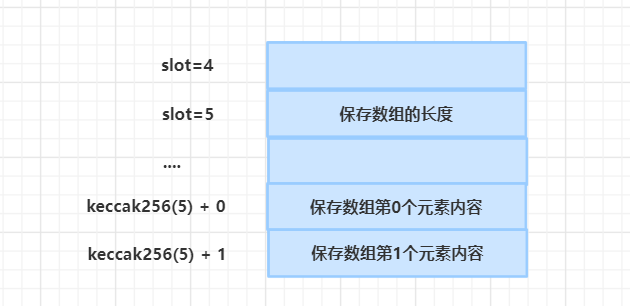

# test-foundry-learnopenzeppelin
### 运行命令
forge test --contracts ./test/testgovernance/TestGovernanceContract.sol -vv

### 下面是详细说明：


```
Dao治理是个常见的需求，openzeppelin帮我们实现了这个功能。功能一点都不复杂，就是第一次接触会感觉涉及的文件有点多。没关系，多看两次就记住了。
参考第三部分的代码，就可以实现功能，为了流畅度，内部一些需要深究的地方，我放在了《补充》这个环节
```


原文发布在 https://github.com/rickwang9/openzeppelin_in_action 这是一个中文社区，学习调试uniswap，compound，aave等源码，分析市面上常见的漏洞。欢迎关注!


# 一 测试环境foundry

本文用的foundry做测试，如果没有安装foundry，参考下面的链接：

https://book.getfoundry.sh/getting-started/installation


# 二 下载代码

本文用到的代码完整版，可通过下面的链接，我在自己的代码中加了注释，也在涉及到openzeppelin的源码里加了注释和Log日志，方便

快速学习原理，定位问题：

https://github.com/rickwang9/openzeppelin_in_action


# 三 一行一行的讲解

## 准备工作-4个合约

1  TargetContract 目标合约，本例中，提案就是为了修改目标合约的手续费设置。

    contract TargetContract is Ownable{
    
        uint256 private fee;
    
        function setFee(uint256 _fee) public onlyOwner {
            fee = _fee;
        }
        ...
    }

2 Token合约，用于投票的。是下面GovernorContract 的构造入参

```
contract GovernorToken is ERC20Votes｛
  constructor() ERC20("GovernanceToken", "GT") ERC20Permit("GovernanceToken") {
    _mint(msg.sender, 10000 * 10 ** decimals());
  }
    ...
}
```

3 TimeLock 合约， 控制时间逻辑的。是下面GovernorContract 的构造入参

```
contract TimeLock is TimelockController {
  constructor(uint256 minDelay, address[] memory proposers, address[] memory executors, address admin) TimelockController(minDelay, proposers, executors, admin) {}
```

4 GovernorContract 治理合约统一入口，提案，投票，查询进度，执行提案等方法都在这里。

```
contract GovernorContract is GovernorSettings,GovernorCountingSimple,GovernorVotesQuorumFraction,GovernorTimelockControl{
	constructor(
        IVotes _token, TimelockController _timelock, uint256 _quorumPercentage, uint256 _votingPeriod,
        uint256 _votingDelay
    )
	function votingDelay() {return super.votingDelay();}
	function votingPeriod() {return super.votingPeriod();}
	function quorum() {return super.quorum();}
	function getVotes() {return super.getVotes();}
	function state() {return super.state();}
	function propose() {return super.propose();}
	function _execute() {return super._execute();}
	function _cancel() {return super._cancel();}
}
```

这些方法都是直接调用父合约的逻辑。也就是我们签名介绍的4个合约。别急，内部实现后面会逐步讲。


## 正式调用

### 1 部署合约

1.1 部署targetContract合约

```
targetContract = new TargetContract();
console.log("TargetContract deployed to:", address(targetContract));
```

1.2 部署tokenContract合约

```
tokenContract = new GovernorToken();
console.log("tokenContract deployed to:", address(tokenContract));
```

1.3 部署TimeLock合约

```
 address[] memory proposers;
 address[] memory executors;
 timeLockContract = new TimeLock(MIN_DELAY, proposers, executors, deployer);
```

1.4 部署GovernorContract合约

```
governorContract = new GovernorContract(tokenContract, timeLockContract,
    QUORUM_PERCENTAGE, VOTING_PERIOD, VOTING_DELAY);
```

| 参数1 | tokenContract合约                                            |
| ----- | ------------------------------------------------------------ |
| 参数2 | TimeLock合约                                                 |
| 参数3 | QUORUM_PERCENTAGE，赞同票百分比。比如QUORUM_PERCENTAGE=60，那就60%的赞同提案就通过。 |
| 参数4 | VOTING_PERIOD 投票持续多少个区块                             |
| 参数5 | VOTING_DELAY 创建提案后多少个区块可以投票                    |


### 2 角色和权限处理

2.1 生成一个主要测试账户：deployer

```
	bytes32 internal nextUser = keccak256(abi.encodePacked("user address"));
    function getNextUserAddress() external returns (address payable) {
        //bytes32 to address conversion
        address payable user = payable(address(uint160(uint256(nextUser))));
        nextUser = keccak256(abi.encodePacked(nextUser));
        return user;
    }
    address payable deployer = getNextUserAddress();
```

2.2 tokenContract给deployer授权

```
address(this)给deployer
tokenContract.delegate(deployer);
```

2.3 系统自带的三个角色

```
bytes32 proposerRole = timeLockContract.PROPOSER_ROLE();//提案角色
bytes32 executorRole = timeLockContract.EXECUTOR_ROLE();//执行提案角色
bytes32 adminRole = timeLockContract.TIMELOCK_ADMIN_ROLE();//角色的管理员角色
```

分配角色

```
timeLockContract.grantRole(proposerRole, address(governorContract)); //timeLockC给给自己分配执行角色
timeLockContract.grantRole(executorRole, ADDRESS_ZERO);//任何人都可以执行
timeLockContract.grantRole(executorRole, address(governorContract));
timeLockContract.revokeRole(adminRole, deployer);//撤回部署人管理员角色
```

### 3 发起流程


看代码前先看张图，方便理解：


#### 3.1 提案

```
uint256 proposalId = governorContract.propose(targetContractAddress ,values, calldatas,PROPOSAL_DESCRIPTION);
```

提案核心就一句话，修改某个合约的关键参数，可能涉及到利益的分配，需要股东们民主表决。

| 参数1 | targetContractAddress 要修改的合约的地址 |
| ----- | ---------------------------------------- |
| 参数2 | values 如果需要, 转ETH                   |
| 参数3 | calldatas 合约的具体方法和传参           |
| 参数4 | 提案的描述信息                           |


#### 3.2 提案后的状态

```
governorContract.SLOG("proposalState after propose :" ,governorContract.state(proposalId));
```

日志如下：

```
proposalState after propose : Pending
```

#### 3.3 投票

```
governorContract.castVoteWithReason(proposalId, VOTE_FOR, reason);
```

| 参数1 | 提案ID                                                 |
| ----- | ------------------------------------------------------ |
| 参数2 | VOTE_Against 0 反对,VOTE_FOR 1 赞同,VOTE_Abstain 2弃权 |
| 参数3 | 原因，字符串，用于event                                |

报错：

Governor: vote not currently active

定位的代码如下：

```
    function _castVote(
        uint256 proposalId,address account,uint8 support,string memory reason,bytes memory params
    ) internal virtual returns (uint256) {
        ProposalCore storage proposal = _proposals[proposalId];
        require(state(proposalId) == ProposalState.Active, "Governor: vote not currently active");
```

投票需要Active，现在是Pending，怎么做？

需要当前区块大于提案的snapshot

```
uint256 currentTimepoint = clock();
if (snapshot >= currentTimepoint) {
	return ProposalState.Pending;
}
```

snapshot又和votingDelay有关。

```
uint256 snapshot = currentTimepoint(创建提案区块) + votingDelay();
```

假设 votingDelay =2, 也就是说两个区块后，state就不再是Pending。


**顺便提一句区块的问题**：

主网，矿工会负责打包，和开发者无关。本地测试环境区块怎么增加？

hardhat：调用transfer方法，会触发打包进入下一个区块

remix：同hardhat

foundry：用作弊码vm


打包两个区块

```
vm.roll(block.timestamp+2);
```

投票

```
governorContract.castVoteWithReason(proposalId, VOTE_FOR, reason);
```


#### 3.4 投票后可能的3种状态

投票后的状态，三种可能：Active，Succeeded，Defeated


Active，投票时间没用完就是Active，哪怕票数早就通过了。

```
uint256 deadline = proposalDeadline(proposalId);
if (deadline >= currentTimepoint) {
    return ProposalState.Active;
}
```

Succeeded，Defeated

```
if (_quorumReached(proposalId) && _voteSucceeded(proposalId)) {
    return ProposalState.Succeeded;
} else {
    return ProposalState.Defeated;
}
```

Succeeded：赞成票达标，提案通过

Defeated：赞成票不达标，提案不通过


#### 3.5 投票通过

通过需要超过deadline

```
uint256 snapshot = currentTimepoint（提案时间点） + votingDelay();
uint256 deadline = proposalDeadline(proposalId);
if (deadline >= currentTimepoint) {
    return ProposalState.Active;
}
```

deadline就是渡过投票期votingPeriod

```
uint256 deadline = snapshot + votingPeriod();
```

执行下面代码

```
vm.roll(block.timestamp+votingPeriod);
```

打印状态看下

```
governorContract.SLOG("proposalState after 4 block:" ,governorContract.state(proposalId));
```

状态：

```
proposalState after 4 block: Succeeded
```


#### 3.6 提案放入队列

将提案放入队列

```
bytes32 descriptionHash = keccak256(bytes(PROPOSAL_DESCRIPTION));
uint queueTx = governorContract.queue(targetContractAddress, values, calldatas, descriptionHash);
```

这里的队列和常规概念的队列不同。

常规的队列：代码解耦，或者缓解服务器压力。

提案的队列：就是为了等。等时间到了，才能执行提案。


如果时间不到，执行下一步的提案会报错：

```
[FAIL. Reason: TimelockController: operation is not ready]
```


为了不报错，我先达到时间的要求

```
vm.warp(block.timestamp+MIN_DELAY +1);
```


打印看下此时的状态

```
proposalState after 2 block: Queued
```


#### 3.7 执行提案

执行提案

```
governorContract.execute(targetContractAddress, values, calldatas, descriptionHash);
```

打印下状态

```
 governorContract.SLOG("proposalState after execute:" ,governorContract.state(proposalId));
```

状态：

```
proposalState after execute: Executed
```

打印fee看是否修改成功

```
uint fee = targetContract.getFee();
console.log('fee ', fee);
```

成功：

```
fee  5
```


最后看下提案的所有状态：

| Pending   | 创建提案后，投票前的状态            |
| --------- | ----------------------------------- |
| Active    | 投票过程中的状态                    |
| Canceled  | 提案已取消，Pending的提案才可以取消 |
| Defeated  | 提案不通过                          |
| Succeeded | 提案通过                            |
| Queued    | 提案通过后，执行前的状态            |
| Expired   | 提案过期                            |
| Executed  | 提案执行成功                        |


# 三 补充

为了流畅，讲解代码过程中的需要解释，需要深入的很多地方我都省略了，都在这里不上。


## 补充1 谁有资格发起提案？


src/governance/TimelockController.sol定义了提案，但是，但是却没用。

```
bytes32 proposerRole = timeLockContract.PROPOSER_ROLE();//提案角色
```


src/governance/Governor.sol  提案方法也没有检查 proposerRole

```
function propose(
        address[] memory targets,
        uint256[] memory values,
        bytes[] memory calldatas,
        string memory description
    ){
    ...
         require(
            getVotes(proposer, currentTimepoint - 1) >= proposalThreshold(),
            "Governor: proposer votes below proposal threshold"
        );
    ...
    }
```

当时却检查了提案人proposer的proposalThreshold。

```
    function _getVotes(
        address account,
        uint256 timepoint,
        bytes memory /*params*/
    ) internal view virtual override returns (uint256) {
        return token.getPastVotes(account, timepoint);
    }
```

跟进getVotes，发现是调用 src/token/ERC20/extensions/ERC20Votes.sol

```
    function getPastVotes(address account, uint256 timepoint) public view virtual override returns (uint256) {
        require(timepoint < clock(), "ERC20Votes: future lookup");
        return _checkpointsLookup(_checkpoints[account], timepoint);
    }
```

也就是提案人持有的token余额。

想为社区发起个提案，却需要有人为你授权才行，这很中心化，很不web3，检查发起人是否持有token合情合理。

结论：openzeppelin虽然设计发起人角色，但是没用。实际使用中检查的发起提案人的角色。当然如果业务需要，你可以覆盖提案的方法，加上提案角色的判断。


## 补充2 代码里随处可见的checkpoint有什么用？

先想个问题：投票投票，这个票到底是什么？

票=Token=你持有的Token， 看个例子：

假如Token总量=1000，

张三的token.balance=300

李四的token.balance=5

王二狗的token.balance=100

那么，张三就有300张选票，同理李四有5张选票，王二狗有100张选票。


投票很少能100%通过的，甚至大部分人都不投票。就设定20%，

total * 20% = 1000 * 20% =200张票


但是，由于token可以swap,mint,burn，导致了大家的票总会变化。


假设这样一种情况，如果张三对新提案不满，burn了自己的300 token，走人了，会出现什么结果：

total=1000 - 300 = 700

赞成票= 700 * 20% =140张


也就是说，不同时刻，token的数量变化了，需要提案通过的票数也都变了，这就需要实时不同时刻的token数量。


看看checkpoint的代码

```
abstract contract ERC20Votes is ERC20Permit, IERC5805 {
    struct Checkpoint {
        uint32 fromBlock;
        uint224 votes;
    }

	mapping(address => Checkpoint[]) private _checkpoints;//1个地址对应1个数组，每个元素都有区块和票数。
	Checkpoint[] private _totalSupplyCheckpoints;
```

看看哪些方法修改这些变量的值：

有人mint时，token增加了，需要记录

```
function _mint(address account, uint256 amount) internal virtual override {
    super._mint(account, amount);
    require(totalSupply() <= _maxSupply(), "ERC20Votes: total supply risks overflowing votes");

    _writeCheckpoint(_totalSupplyCheckpoints, _add, amount);
}
```

有人burn时，token减少了，需要记录

```
function _burn(address account, uint256 amount) internal virtual override {
    super._burn(account, amount);

    _writeCheckpoint(_totalSupplyCheckpoints, _subtract, amount);
}
```

有人delegate时，委托他人投票，虽然总量没变，当时个人手中的票变了，需要记录

```
function _delegate(address delegator, address delegatee) internal virtual {
    address currentDelegate = delegates(delegator);
    uint256 delegatorBalance = balanceOf(delegator);
    _delegates[delegator] = delegatee;//授权关系，

    emit DelegateChanged(delegator, currentDelegate, delegatee);

    _moveVotingPower(currentDelegate, delegatee, delegatorBalance);
}
```

_moveVotingPower代码如下

```
function _moveVotingPower(address src, address dst, uint256 amount) private {
    if (src != dst && amount > 0) {
        if (src != address(0)) {
            (uint256 oldWeight, uint256 newWeight) = _writeCheckpoint(_checkpoints[src], _subtract, amount);
            emit DelegateVotesChanged(src, oldWeight, newWeight);
        }

        if (dst != address(0)) {
            (uint256 oldWeight, uint256 newWeight) = _writeCheckpoint(_checkpoints[dst], _add, amount);
            emit DelegateVotesChanged(dst, oldWeight, newWeight);
        }
    }
}
```

最后看下_writeCheckpoint的实现

```
function _writeCheckpoint(
    Checkpoint[] storage ckpts,
    function(uint256, uint256) view returns (uint256) op,
    uint256 delta
) private returns (uint256 oldWeight, uint256 newWeight) {
    uint256 pos = ckpts.length;

    unchecked {
        Checkpoint memory oldCkpt = pos == 0 ? Checkpoint(0, 0) : _unsafeAccess(ckpts, pos - 1);

        oldWeight = oldCkpt.votes;
        newWeight = op(oldWeight, delta);

        if (pos > 0 && oldCkpt.fromBlock == clock()) {
            _unsafeAccess(ckpts, pos - 1).votes = SafeCast.toUint224(newWeight);
        } else {
            ckpts.push(Checkpoint({fromBlock: SafeCast.toUint32(clock()), votes: SafeCast.toUint224(newWeight)}));
        }
    }
}
```


| 参数1 | 一个账户对应一个Checkpoint[]                                 |
| ----- | ------------------------------------------------------------ |
| 参数2 | op是函数，_add(uint256 a, uint256 b) 或者_subtract(uint256 a, uint256 b) |
| 参数3 | delta是变化量，mint调用时就是mint数量，burn调用时就是burn数量 |


再看投票的逻辑：

```
    function _countVote(
        uint256 proposalId,
        address account,
        uint8 support,
        uint256 weight,
        bytes memory // params
    ) internal virtual override {
        ProposalVote storage proposalVote = _proposalVotes[proposalId];

        require(!proposalVote.hasVoted[account], "GovernorVotingSimple: vote already cast");
        proposalVote.hasVoted[account] = true;

        if (support == uint8(VoteType.Against)) {
            proposalVote.againstVotes += weight;
        } else if (support == uint8(VoteType.For)) {
            proposalVote.forVotes += weight;
        } else if (support == uint8(VoteType.Abstain)) {
            proposalVote.abstainVotes += weight;
        } else {
            revert("GovernorVotingSimple: invalid value for enum VoteType");
        }
    }
```

逻辑1：投票过，无法再投票，也就是说投票后，你再mint无效。

逻辑2：投票后，burn掉，之前投的票已经累计了，不再变化。


再看统计提案是否通过的逻辑：

```
        if (_quorumReached(proposalId) && _voteSucceeded(proposalId)) {
            return ProposalState.Succeeded;
        } else {
            return ProposalState.Defeated;
        }
```

先分析_quorumReached

```
    function _quorumReached(uint256 proposalId) internal view virtual override returns (bool) {
        ProposalVote storage proposalVote = _proposalVotes[proposalId];
        SLOG(' quorum(proposalSnapshot(proposalId))', quorum(proposalSnapshot(proposalId)));
        SLOG(' proposalVote.forVotes', proposalVote.forVotes);
        SLOG(' proposalVote.abstainVotes', proposalVote.abstainVotes);
        return quorum(proposalSnapshot(proposalId)) <= proposalVote.forVotes + proposalVote.abstainVotes;
    }
```

逻辑：赞成票+弃权票>=quorum,quorum是用户传给合约的参数。在openzeppelin的逻辑里，不反对就是赞成！


再看_voteSucceeded

```
    function _voteSucceeded(uint256 proposalId) internal view virtual override returns (bool) {
        ProposalVote storage proposalVote = _proposalVotes[proposalId];
        SLOG(' proposalVote.againstVotes', proposalVote.againstVotes);
        return proposalVote.forVotes > proposalVote.againstVotes;
    }
```

逻辑：赞成票必须大于反对票


## 补充3 Assembly方法-_unsafeAccess

在_writeCheckpoint，有这样一行代码

```
Checkpoint memory oldCkpt = pos == 0 ? Checkpoint(0, 0) : _unsafeAccess(ckpts, pos - 1);
```

再看_unsafeAccess

```
    function _unsafeAccess(Checkpoint[] storage ckpts, uint256 pos) private pure returns (Checkpoint storage result) {
        assembly {
            mstore(0, ckpts.slot)
            result.slot := add(keccak256(0, 0x20), pos)
        }
    }
```

问题来了，这段代码什么意思？为什么要有汇编，不用不行吗？


先解释什么意思

_unsafeAccess 取数组ckpts的位置pos的元素，如取ckpts的第5个元素。


解释具体代码，需要一些前提知识：

1 storage是存储变量，存储变量有个slot编号，从0,1.2...这样下去。

2 动态数组，因为长度是变化，EVM不知道给它留多少空间，才能存放下一个变量。所以只留一个slot槽，存放数组长度。

3 具体的数组的内容，前面存放数组长度的slot，计算出新的slot，值都是通过sha3计算，很大，不会覆盖前面的变量。

4  具体公式如下：item[i].slot = keccak256(arrayLength.slot) + i





mstore(0, ckpts.slot)：

mstore写内存，在偏移地址=0的位置，写入值，值是数组的slot，也就是存放数组长度的slot。


keccak256(0, 0x20)：

keccak256计算哈希值，在内存上取值作为种子，也就是上一行的刚刚存入的ckpts.slot。


add：

表示加法，公式中第i个元素，就需要加i。


# 四 引用

https://learnblockchain.cn/article/3997

https://learnblockchain.cn/article/6207


# 五 最后


原文发布在 https://github.com/rickwang9/openzeppelin_in_action

我计划把uniswap ，compound，aave等经典合约的部署，测试，调试，学习代码录入我的代码库中，另外我学习的各种漏洞和安全的分析也会放入其中，主要是作为我的学习笔记，也可以供需要的人参考，欢迎关注。

本篇是Governance专题，升级合约和Token会在后面补上。
